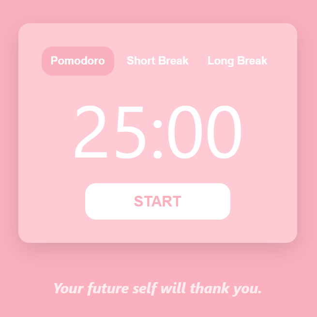
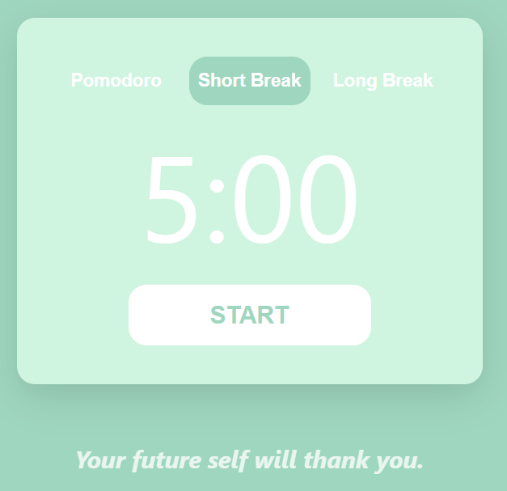
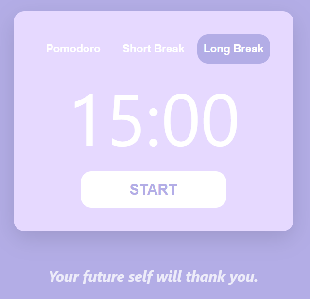

# 🍅 Pomodoro Timer Web App

A simple and responsive Pomodoro Timer web application.
The app follows the classic Pomodoro technique to help users stay focused and manage breaks effectively.

## Features

- 25-minute Pomodoro (focus) session
- 5-minute short break
- Automatically switches to a 15-minute long break after 4 Pomodoro sessions
- Timer controls:
  - Start
  - Stop
  - Resume
  - Start over (reset)
- Random motivational quote displayed under the timer
  - Quote changes on every page refresh
- Fully responsive layout for both mobile and desktop devices

## Built With

- React
- JavaScript
- Vite
- CSS

## Screenshots

  
  
  

